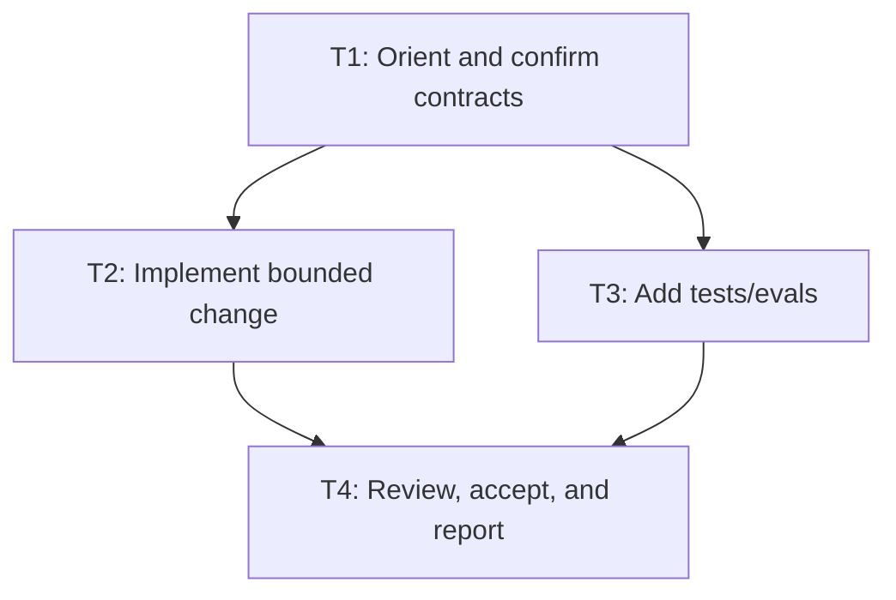

# Plan Contract

## Objective

State the concrete outcome and why it matters.

## Scope

### In scope

-

### Out of scope

-

### Assumptions

-

## Goal execution posture and delivery

Use this plan as a long-running goal contract unless the user explicitly asked for a compact slice. Thread highlights are the short in-chat version; this `.md` file is the durable source of truth.

- Markdown plan file path:
- Thread highlights to return: objective, user expectation/surprise risks, critical path, top risks, proof gates, next checkpoint, and blockers.
- Execution horizon: long-running goal / compact task / spike, and why:
- Checkpoint cadence:
- Work package granularity: phases/checkpoints/slices inside the larger goal, not a default 20-minute slice:
- Uberslice exception? no/yes, with explicit user request if yes:

## User expectation / surprise assessment

Use this to avoid surprises, not to mind-read. Ground the assessment in the explicit request, known user preferences, repo instructions, and live evidence. If any assumption could materially change scope, ask or flag it before proceeding.

- User-visible expectation inferred:
- Evidence for expectation:
- Planned actions that may surprise the user:
- Assumptions that may be wrong:
- Choices likely to conflict with user preference:
- Ask/flag-before-proceeding triggers:
- Final handoff expectation check:

## Uberassess plan-assessment loop

Use this to assess the draft plan itself before implementation readiness. For tiny deterministic work, say why this is skipped.

- Plan artifact assessment needed? yes/no, because:
- Uberassess packet path or inline plan-artifact assessment:
- Intent fit finding:
- Clarifications requested or assumptions recorded:
- Research/evidence gaps found in the plan:
- Alternatives/deletion options raised by assessment:
- Plan revision decision: approve as-is / revise then proceed / deeper assessment / eval-only / watch / reject:
- Plan changes made from assessment:

## Pre-planning research / assessment boundary

Use this whenever the request starts from a source, bookmark, vague idea, implementation question, alternatives/state-of-the-art question, or "boil the ocean" research request. Users may start with `uberplan`; `uberplan` should enact the `uberassess` boundary by consuming an existing packet, running an in-plan assessment phase, or explicitly marking the missing assessment as a blocker/spike.

- Assessment needed? yes/no, because:
- Uberassess packet path, inline packet reference, or in-plan assessment summary:
- Assessment decision/recommendation consumed:
- Research question:
- Coverage claimed:
- Coverage not claimed / gaps:
- Local codebase/docs evidence:
- Primary docs/specs evidence:
- Alternatives/prior art evidence:
- Forums/issues/practitioner evidence:
- Contradiction/simpler-alternative evidence:
- Clarification needed before broad assessment? yes/no, question(s) or assumptions:
- Approval state for planning:
- If no assessment exists, why planning may proceed anyway or why this is a blocker/spike:

## Product / PRD checklist

Use this as the checkable product requirements document for Tier 2/3 work. Keep it specific enough that coding agents can mark items complete without guessing.

- User / operator problem:
- Primary user-visible outcome:
- Non-goals:
- Acceptance target:
- [ ] Requirement:
- [ ] Requirement:
- [ ] Requirement:
- [ ] Test/eval evidence captured:
- [ ] Deferred item recorded with owner:

## Task map / implementation graph

For Tier 2/3 work, provide stable task IDs, dependencies, owners, write scopes, done conditions, evidence, and whether each task is serial, parallelizable, or on the critical path. Include a Mermaid diagram that coding agents can follow.



| Task ID | Purpose | Dependencies | Owner | Write scope | Done condition | Required evidence |
|---|---|---|---|---|---|---|
| T1 |  | none |  |  |  |  |
| T2 |  | T1 |  |  |  |  |
| T3 |  | T1 |  |  |  |  |

## Verifiable subgoals and metrics

For Tier 1+ work, convert the objective into high-quality subgoals. Every subgoal needs observable evidence; use quantitative scores where useful, but allow qualitative rubrics when judgment is the product.

| Subgoal ID | Outcome | Acceptance evidence | Metric / score / rubric | Owner | Parallelizable? | Done when |
|---|---|---|---|---|---|---|
| G1 |  | command/artifact/eval/manual proof |  |  | yes/no/serial |  |
| G2 |  | command/artifact/eval/manual proof |  |  | yes/no/serial |  |

## Parallelization plan

Plan the work graph even if the current runtime or user does not authorize subagents. Mark what can run in parallel, what must stay serial, and what write scopes must remain disjoint. Do not spawn agents unless the active runtime/user policy allows it.

- Critical path:
- Parallelizable slices:
- Serial/blocking slices:
- Disjoint write scopes:
- Max concurrency / batching policy:
- Integration order:
- If subagents are not authorized or unavailable:

## Testing adaptation gate

Use this during implementation/testing so clear systematic failures revise the goal instead of becoming a brute-force loop.

- Failure streak threshold: stop before or at five consecutive clear failures of the same test command/failure family.
- Systematic failure signal:
- Stop action:
- RCA artifact:
- Plan revision path:
- Resume rule:

## Tier decision

- Tier: 0 / 1 / 2 / 3
- Why this tier is sufficient:
- Why this tier is not overkill:
- Concrete risks that justify this tier:

## Cost/complexity check

- Failure class this plan prevents:
- Smaller alternative considered:
- Added machinery and why it is worth it:
- Benefit >> cost argument:
- Hidden downstream costs considered:
- Machinery deferred because cost exceeds current benefit:

## Clarifying questions gate

Required when requirements, edge cases, integrations, approval boundaries, or success criteria are ambiguous. If not applicable, say why.

- Material ambiguities:
- Questions asked / answers received:
- Recommendations when user says "use judgment":
- Gate verdict: proceed to architecture? yes/no

## Codebase exploration / pheromone trail

Required when the codebase is complex, unfamiliar, or context-heavy enough that missing context is a material risk. Use `exploration-trail.md` when separate scouts are useful and authorized.

- Exploration mode: main-agent / parallel scouts / not applicable because:
- Slices explored:
- Key files returned and read by overseer:
- Pheromone trail location:
- Unknowns/follow-up angles:

## Architecture options

Required for non-obvious feature architecture. Keep concise; do not force this for small deterministic edits.

| Option | Summary | Benefits | Costs/risks | Recommendation |
|---|---|---|---|---|
| Minimal |  |  |  |  |
| Clean |  |  |  |  |
| Pragmatic |  |  |  |  |
| First-principles alternative | delete/substitute/reframe before optimizing |  |  |  |

## Affected surfaces

| Surface | Files/areas | Risk | Owner |
|---|---|---|---|
|  |  |  |  |

## Target architecture / file tree

Required for new, moved, or meaningfully reorganized code files. Propose the intended structure before implementation so coding agents do not create root-level dumps, random helpers, or mixed-concern folders. If not applicable, say why.

```text
<target package or repo slice>/
  <owning module>/
    <public seam file>
    <private implementation file>
    tests/
```

- Owning package/folder:
- Public seams:
- Private/internal modules:
- Tests/evals location:
- Files/folders to avoid or delete:
- Separation-of-concerns rationale:

## Repository topology / package seam

Required for any new or moved code file. Keep this small and executable.

- Intended package/module destination:
- Why this does not belong at the root/convenience layer:
- Public import/API seam:
- Private/internal files:
- Repo-local topology/dependency guard to run or add:
- If no guard exists, why that is acceptable for this task:

## Architecture classification

Classify relevant components: deterministic workflow, augmented LLM call, agent loop, multi-agent/subagent system, tool/tool registry, skill, memory subsystem, source lane, identity layer, context engine, durable execution, guardrail/human review, cross-agent coordination, attention policy, adoption-state change, eval/observability layer.

## Planning review board

Activate only the lanes justified by tier and risk. For Tier 2/3, complete `planning-review-board.md` or embed its findings here.

- Lanes activated:
- Lanes skipped, and why:
- Findings reconciled into this plan:
- Board verdict: allow confidence gate? yes/no

## First-Principles Simplifier / Complexity Auditor

Required for Tier 2/3 and final acceptance. This lane should aggressively fight complexity and require benefit >> cost for additions.

- Simplifier mode: main-agent pass / separate strongest-reasoning subagent / not applicable because:
- Requirements challenged or deleted:
- Parts/processes/agents/schemas/files removed:
- First-principles alternative considered:
- Benefit >> cost verdict:
- Simplifier verdict: proceed? yes/no

## Agent Advocate / Agent Failure RCA

Required when the task changes multi-agent behavior or fixes an agent mistake. If not applicable, say why.

- Advocate mode: main-agent pass / separate subagent / not applicable because:
- Agent-eye reconstruction source: traces/prompts/context/tool outputs/logs/other:
- Root failed invariant, if known:
- Symptom-patch risk: low/medium/high:
- Advocate verdict: proceed? yes/no

## Architecture Steward lane

Required for Tier 2/3 and any agentic-system behavior. If subagents are not authorized, the main agent performs this pass.

- Steward mode: main-agent pass / separate subagent / not applicable because:
- Guide sections to load, and why:
- Planning-stage steward findings:
- Blocker authority: launch cannot proceed until material steward blockers are resolved.

## Deterministic harness vs adaptive policy

| Deterministic harness owns | Model/adaptive policy owns |
|---|---|
| schemas, permissions, idempotency, budgets, tests, traces, side-effect gates | ambiguous intent, context gathering, plan revision, synthesis, tool choice within harness |

## Thin harness / fat agent design rubric

Required for agentic-system behavior. The default target is a thin deterministic harness around a capable adaptive agent, not a deterministic monolith that imitates agency.

- Harness owns:
- Agent owns:
- Monolith risk assessment:
- Deterministic branches/routers/regex/keyword uses reviewed:
- Reusable skills/tools to create or reuse:
- Modular boundaries and encapsulated dependencies:
- Downstream tool wrapper boundaries, if any:
- Thin-harness score and blocker notes:

## Agent execution proof ladder

Required for OpenClaw or agentic-system plans. First prove Codex can do the activity with the right skills/tools/context, then prove OpenClaw or the target runtime reaches parity. If a proof fails, improve the skill/tool/context contract before adding orchestration. Do not call readiness until the target-runtime parity proof succeeds twice, or label the missing proof as a blocker/spike.

- Codex subagent proof target:
- Skills/tools/context packet:
- If Codex subagent proof fails:
- Codex proof evidence:
- OpenClaw or target-runtime proof target:
- If OpenClaw or target-runtime proof fails:
- Parity/double-proof standard:
- Proof verdict:

## Source-convention check

Required for agentic-system behavior when Codex, OpenClaude, Claude Code, or similar source conventions are material. Use approved public/local source references and extract conventions, not copied proprietary or leaked code.

- Source handles checked, or why unavailable:
- Codex conventions adopted:
- OpenClaude / Claude Code conventions adopted:
- Conventions rejected, and why:
- No leaked/proprietary code copied:
- Dependency or license caveats:

## Agent Boundary Contract

Required when model output can become tool input, state, memory, context, delegated work, external action, or durable truth. If not applicable, say why.

- Boundary surfaces:
- Shape contract:
- Authority contract:
- Isolation contract:
- Failure semantics:
- Observability/replay evidence:
- Sentinel probes checked: wrong-shaped identifiers, swallowed errors, ambiguity/no ask path, shared mutable state, untrusted memory/context, unbounded loop, privileged action, parent-context dump, missing trace propagation, or not applicable because:
- Boundary verdict: proceed? yes/no

## Regex / keyword semantic gate

Required for agentic-system behavior and for any added or changed regex, pattern list, keyword list, string matcher, classifier, router, or heuristic over human language. Regex/keywords may parse mechanical syntax; they must not decide semantic judgment over natural language unless explicitly approved as an exception.

- Pattern uses introduced/touched:
- Classification for each use: mechanical syntax / candidate signal / semantic authority:
- Semantic authority over natural language present? yes/no
- If yes, explicit exception approval and why model policy is not sufficient:
- Raw input preserved for model/review? yes/no
- Eval/replay/negative cases:
- Observability and rollback:
- Gate verdict: proceed? yes/no

## Source authority and truth boundaries

State authoritative sources, retrieval-only sources, synthesis artifacts, sidecars, and promotion rules. If not relevant, say why.

## Side effects, approvals, and rollback

- External writes/destructive actions:
- Required human approvals:
- Idempotency/undo strategy:
- Adoption state before:
- Adoption state after:
- Rollback plan:
- Checkpoint/replay policy:
- Trace IDs/artifact locations:
- Budget/backpressure/fallback policy:
- Max agents/audit rounds, if any:

## Multi-agent plan

Only fill this if the user explicitly authorized subagents/parallel work.

| Agent role | Purpose | Write set / read scope | Return contract | Stop condition |
|---|---|---|---|---|
| Overseer/integrator | Own plan, decomposition, integration, final acceptance | all claimed files | final synthesis and evidence | rubric satisfied or blocked |
| Architecture Steward | Participate in planning, enforce relevant agentic architecture guide, challenge over/under-complexity, block launch/acceptance on material architecture gaps | read plan/relevant files; no writes unless separately assigned | `architecture-steward-report.md` with blockers/non-blockers tied to evidence | no material architecture blockers |
| Agent Advocate / Agent Failure RCA | Reconstruct why an agent made or would make the error; prevent symptom patches | read traces/prompts/context/tool outputs/logs; no writes unless separately assigned | `agent-failure-rca.md` with failed invariant and recurrence evidence | root cause understood or plan blocked |
| Loophole Hunter / Red Team | Try to disprove the plan before implementation | read plan/relevant files | blocker/non-blocker loopholes tied to evidence | no material loopholes |
| Simplifier / Elegance Reviewer | Find smaller/simpler plan that sidesteps problems | read plan/relevant files | simplification proposal and tradeoffs | adopted or explicitly rejected |
| First-Principles Simplifier / Complexity Auditor | Aggressively delete, simplify, and require benefit >> cost for every addition | read plan/relevant files; no writes unless assigned | `first-principles-simplifier-report.md` | benefit >> cost or plan blocked |
| Codebase Scout / Cartographer | Bring codebase-specific patterns, tests, and constraints into plan | read codebase/tests/claims | codebase map and hazards | no material codebase ignorance |
| OpenClaw / Platform Steward | Bring OpenClaw/Type0/runtime/local-policy constraints when relevant | read local policy/docs only as needed | platform constraints and preflight needs | no policy/protected-file blockers |
| Quality/Eval Strategist | Ensure risk-to-evidence map and rubric are real | read plan/tests/evals | evidence matrix | no material evidence gaps |

## Code-health / dead-code tool plan

Required for Tier 2/3 work and for refactors, deletions, new modules, or package moves. Use repo-local tools first; name gaps explicitly. Static dead-code tools produce candidates, not automatic deletion authority.

- Stack/languages touched:
- Repo-local lint/type/test gates:
- Dead-code/static tools to run or why unavailable: Python `vulture`, `ruff`, `pyright`/`mypy`; TS/JS `knip`, `ts-prune`, `depcheck`, `eslint`, `tsc`; plus `grep`/`git grep`/call-site review as applicable.
- Dynamic-reference safeguards: CLI entrypoints, framework routes, configs, migrations, prompts, tools, plugins, generated files, and external references checked.
- Deletion/refactor candidates and proof required:
- Tool findings treated as candidates, not deletion authority:
- Cleanup accepted/deferred:

## Risk-to-evidence map

| Risk/failure mode | Required evidence | Command/artifact | Owner |
|---|---|---|---|
|  | unit/regression/integration/UI/eval/audit/manual proof |  |  |

## Acceptance rubric

Score only relevant dimensions. Use 0 = blocker, 1 = weak/unresolved, 2 = acceptable with named residual risk, 3 = strong evidence.

| Dimension | Pass condition | Required evidence | Score |
|---|---|---|---|
| Scope clarity | In/out/non-scope and assumptions are explicit | plan contract |  |
| Planning review | Relevant agent-advocate/loophole/simplifier/codebase/platform/quality lanes ran or were explicitly skipped | Planning Review Board verdict |  |
| Cost/complexity | The plan uses the smallest guardrails that address named failure classes and benefit >> cost | Cost/complexity check |  |
| First-principles simplification | Requirements and added machinery were challenged; deletion/simplification was considered | Simplifier report |  |
| Codebase exploration | Key files/patterns/tests were explored when context risk was material | Exploration trail or explicit non-applicability |  |
| Agent RCA | Agent behavior fixes name why the agent erred and the failed invariant/tool/context/source/eval layer | Agent Advocate report or explicit non-applicability |  |
| Agent boundary contract | Model-output boundaries have shape, authority, isolation, failure, observability, and replay/eval evidence | Agent Boundary Contract section or explicit non-applicability |  |
| Regex / keyword semantics | Regex/keyword uses are classified; natural-language semantic authority is prohibited unless explicitly approved with eval/replay and rollback | Regex / keyword semantic gate |  |
| PRD checklist | Requirements, non-goals, acceptance targets, and deferred items are checkable | Product / PRD checklist |  |
| Task map | Coding tasks have stable IDs, dependencies, owners, write scopes, done conditions, evidence, and Mermaid graph | Task map / implementation graph |  |
| Verifiable subgoals | Objective is decomposed into observable subgoals with evidence and metrics/rubrics | Verifiable subgoals and metrics |  |
| Parallelization | Critical path, parallelizable slices, serial blockers, disjoint write scopes, batching, and integration order are explicit | Parallelization plan |  |
| Testing adaptation | Repeated clear failures stop the loop, trigger RCA, revise the plan, and resume under the goal lifecycle | Testing adaptation gate |  |
| Goal execution posture | Plan is framed as a long-running goal with thread highlights, checkpoint cadence, and durable `.md` artifact | Goal execution posture and delivery |  |
| User expectation / surprise assessment | The plan states likely user expectations, evidence for them, possible surprising actions, assumptions to verify, and final handoff checks | User expectation / surprise assessment |  |
| Agent execution proof ladder | Codex subagent proof, skill/tool/context iteration, and OpenClaw or target-runtime double proof are explicit where relevant | Agent execution proof ladder or explicit non-applicability |  |
| Thin harness / fat agent | Agentic behavior keeps deterministic code in the harness and adaptive judgment in the agent; monolith/regex/router drift is blocked | Thin harness / fat agent rubric |  |
| Source-convention check | Approved/local/public Codex and OpenClaude/Claude Code conventions were checked where material; no leaked/proprietary code copied | Source-convention check |  |
| Architecture | Relevant guide sections were applied; deterministic harness/adaptive policy split is respected where relevant | Architecture Steward report or explicit non-applicability |  |
| Target file tree | New/moved/reorganized files have a proposed owning package, public/private seams, test/eval locations, and separation-of-concerns rationale | Target architecture / file tree |  |
| Repository topology | New/moved code files land in named packages and repo topology/dependency guard is run or added | topology test/dependency-map command or explicit accepted gap |  |
| Ownership | Write sets and integrator role are clear | claim/briefs |  |
| Code quality | Code is simple, maintainable, typed/idiomatic where applicable | review/tests |  |
| Dead code | References searched and deletions justified; stack-appropriate dead-code tools run or unavailable gaps named | code-health/dead-code tool plan plus tool output |  |
| Unit/regression tests | Changed behavior has focused coverage | test command output |  |
| Integration tests | Cross-component behavior is verified where relevant | command/output or explicit non-applicability |  |
| UI/browser tests | User-visible UI flows verified where relevant | browser/e2e evidence or explicit non-applicability |  |
| Evals | Judgment/model behavior uses real-world fixtures where available | eval cases/results or explicit non-applicability |  |
| Safety | External/destructive side effects are approved and idempotent | approval/evidence |  |
| Observability | Logs/traces/artifacts are enough to debug failures | trace/log artifacts |  |
| Rollback | Revert/adoption-state plan exists | rollback note |  |
| Decision/tradeoff register | Issues, tradeoffs, implementation choices, and surprising decisions are explicit | Decision / tradeoff / surprise register |  |
| Over-orchestration review | Plan was simplified before presentation and unnecessary agents/files/templates/process were removed | Pre-presentation over-orchestration review |  |
| Plan acceptance | Plan was rejected or accepted against OpenClaw/agentic architecture, thin-harness/fat-agent policy, topology, dead-code, and evidence gates | Plan acceptance gate |  |
| Acceptance evidence | Commands, outputs, screenshots/traces/gaps recorded | final acceptance report |  |

## Decision / tradeoff / surprise register

Required before launch and final handoff. Record issues, implementation choices, tradeoffs, and anything likely to surprise a future agent or human reviewer.

| Item | Type: issue/tradeoff/choice/surprise | Decision or finding | Why it was chosen / accepted | Risk or surprise | Follow-up / owner |
|---|---|---|---|---|---|
| D1 |  |  |  |  |  |

## Pre-presentation over-orchestration review

Required before presenting the thread highlights or final plan file. Hunt for added process that does not earn its cost, then revise the plan before showing it.

- Uberslice / 20-minute collapse checked:
- Unnecessary agents/lanes/templates/files removed:
- Better context/tool/source fix considered before extra process:
- Deterministic harness / regex / router creep checked:
- Duplicate artifacts or planning bureaucracy removed:
- Plan revisions made before presenting:
- Review verdict: present? yes/no

## Plan acceptance gate

Required for Tier 2/3 before implementation. Try to reject the plan before launch, especially for OpenClaw/agentic architecture drift and fat-harness creep.

- OpenClaw / agentic architecture policy checked:
- User expectation / surprise assessment checked:
- Thin-harness / fat-agent adherence:
- Fat-harness or deterministic-monolith risk:
- Source authority / tool-contract / context-affordance gaps:
- File-tree/topology/dead-code plan adequate:
- Issues/tradeoffs/surprises recorded:
- Material blockers:
- Acceptance verdict: proceed? yes/no

## Pre-launch confidence gate

Complete this before launch.

```text
Confidence verdict:
- 100% confident within scope? yes/no
- Scope:
- Material blockers:
- Non-blocking residual risks:
- Required revisions:
- Evidence required before completion:
```
