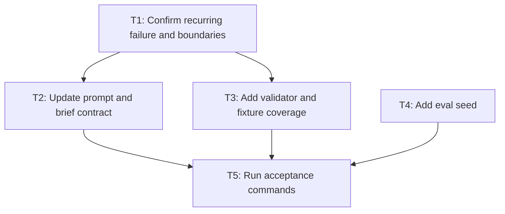

# Plan Contract

## Objective
Launch a Tier 3 true E2E production replacement proof for an agentic runtime by sending one flat plan directly into a giant p10 final proof run after a small canary.

## Scope
In scope: one flat plan that launches a long-run agentic runtime burn-in and final proof over production-replacement evidence. Out of scope: child plan files, status ledgers, and contract-fuzz preflights.

## Goal execution posture and delivery
- Markdown plan file path: `plans/2026-05-21-multi-agent-handoff-contract.md`
- Thread highlights to return: objective, user expectation/surprise risks, critical path, top risks, proof gates, next checkpoint, and blockers.
- Execution horizon: long-running goal because the handoff contract needs staged prompt, validator, eval, and acceptance checkpoints rather than a default compact task.
- Checkpoint cadence: after contract orientation, after validator/eval updates, and after acceptance commands.
- Work package granularity: phases/checkpoints inside the larger goal; no 20-minute slice is used as the plan boundary.
- Uberslice exception? no; the user did not request an uberslice and the work should not collapse into a 20-minute slice.

## User expectation / surprise assessment
- User-visible expectation inferred: the user expects a durable multi-agent handoff contract that prevents worker overwrite surprises, not a generic prompt warning or hidden orchestration layer.
- Evidence for expectation: the request names repeated multi-agent overwrite behavior, asks for evidence-backed findings, and this repo's instructions prefer small validators over prose-only policy when drift is possible.
- Planned actions that may surprise the user: adding validator fixture coverage could surprise the user if presented as behavioral proof, so the plan labels fresh-agent behavioral replay as a deferred gap.
- Assumptions that may be wrong: the plan assumes local skill-package validation is enough for this contained change and that no live OpenClaw runtime proof is required before local readiness.
- Choices likely to conflict with user preference: building a broad eval harness or extra orchestration agents would conflict with the user's preference for benefit >> cost and no ceremony creep.
- Ask/flag-before-proceeding triggers: ask or flag before adding new skills, CI, broad eval infrastructure, external writes, commits, pushes, or overlapping worker write scopes.
- Final handoff expectation check: final acceptance must compare the expected durable handoff contract against actual files, tests, gaps, and any surprising implementation choices.

## Definition of Done / Operational Outcome Contract
- Intended operational outcome: updated prompt/template/validator behavior is implemented in the skill package and rejects missing multi-agent ownership evidence.
- What counts as implemented/operational for this plan: source files are changed in the intended package, validator tests pass, and the final acceptance report names residual fresh-agent replay gaps.
- Real-system or target-system wiring required: local skill package wiring through SKILL.md, templates, validators, and eval seeds; no live runtime wiring is in scope.
- Tests/evals/live or target-runtime proof required: unit/regression validator tests, package lint, and eval seed/schema checks; live target-runtime proof is explicitly deferred.
- What does NOT count as implementation: readiness gate / safe adoption spine / registry / plan / eval fixture / local proof / shadow-only proof / shared parent proof unless explicitly scoped as final outcome: a plan-only note or eval seed without validator/template changes does not satisfy this plan.
- Allowed terminal states: operational | blocked | re_scoped_with_approval
- Blocked terminal-state rule: record exact blocker, evidence, next unblock action, and owner/prerequisite.
- Re-scoped terminal-state rule: record user approval evidence and original outcome as deferred/not done.

## Product / PRD checklist
- User / operator problem: coding agents in a multi-agent handoff can overwrite each other or claim success without evidence.
- Primary user-visible outcome: worker handoffs are clear enough that agents preserve file ownership and return evidence-backed findings.
- Non-goals: no live runtime change, no new service, no production writes, and no broad fresh-agent eval platform.
- Acceptance target: prompt/template/validator changes create a checkable contract and fail plans that omit ownership, evidence, or agent-boundary requirements.
- [x] Requirement: every worker brief names role, read scope, disjoint write scope, return contract, and stop condition.
- [x] Requirement: plan validation fails when the agent boundary contract or ownership evidence is missing.
- [x] Requirement: acceptance evidence includes unit/regression, integration-shape, acceptance, simulation/e2e substitute, and eval/replay coverage notes.
- [x] Test/eval evidence captured: validator fixtures and golden eval seeds are updated from the recurring shared-file overwrite failure.
- [x] Deferred item recorded with owner: fresh-agent behavioral replay remains owned by the future evaluator when the pack grows a live eval harness.

## Task map / implementation graph



| Task ID | Purpose | Dependencies | Owner | Write scope | Done condition | Required evidence |
|---|---|---|---|---|---|---|
| T1 | Reconstruct the agent failure and source contracts | none | overseer | plan only | failed invariant and non-goals are explicit | Product / PRD checklist and Agent Advocate section |
| T2 | Make worker handoff reusable and modular | T1 | prompt owner | SKILL.md, templates/agent-brief.md | role/read/write/return/stop contract is checkable | template review and rubric score |
| T3 | Add deterministic harness validation without semantic regex authority | T1 | validator owner | scripts/validate_plan_contract.py, tests/fixtures | invalid plans fail and valid plan passes | unit/regression test output |
| T4 | Preserve real bug as eval seed | T1 | eval owner | evals/golden_skill_invocations.json | recurring overwrite bug is captured as replayable fixture | eval schema test output |
| T5 | Acceptance review and report | T2, T3, T4 | integrator | no new writes except report | all goals satisfy acceptance rubric | unittest, package lint, and acceptance summary |

## Verifiable subgoals and metrics

| Subgoal ID | Outcome | Acceptance evidence | Metric / score / rubric | Owner | Parallelizable? | Done when |
|---|---|---|---|---|---|---|
| G1 | Worker handoff contract is checkable | agent brief/template review | rubric score 3 for ownership and evidence | prompt owner | yes | role/read/write/return/stop fields are present |
| G2 | Validator catches missing planning evidence | unittest invalid fixtures | 100% of targeted invalid fixtures fail | validator owner | yes | validator tests pass |
| G3 | Behavioral lesson is replayable later | golden eval seed | eval schema includes recurrence case | eval owner | serial after G1 | eval schema test passes |

## Parallelization plan

- Critical path: T1 defines the invariant, then T5 acceptance waits for prompt/template, validator, and eval updates.
- Parallelizable slices: T2 prompt/template work and T3 validator fixture work can run in parallel after T1; T4 eval seed can run after T1 and reconcile before T5.
- Serial/blocking slices: T1 root-invariant reconstruction and T5 final acceptance are serial blockers.
- Disjoint write scopes: prompt/template files, validator/tests, and eval JSON are separate write scopes.
- Max concurrency / batching policy: up to three independent slices if subagents are authorized; otherwise main agent performs them sequentially.
- Integration order: merge prompt/template, validator, then eval seed, then run full package checks.
- If subagents are not authorized or unavailable: no subagents are required; the main agent performs all slices and records degraded parallelism only as a note.


## Runtime agent topology / Codex depth-thread policy

- Config source / observed source: planned local Codex config `/Users/claw1/.codex/config.toml` or runtime-reported `[agents]` settings.
- Standard campaign preset: `max_threads=6`, `max_depth=2`.
- Current or planned `max_threads`: 6.
- Current or planned `max_depth`: 2.
- Role shape: L0 root orchestrator -> L1 workstream orchestrator -> L2 worker/reviewer.
- Does this plan need depth 3? no, this handoff contract can be executed with standard L0/L1/L2 or main-agent sequential mode.
- If depth 3 is needed, prompt text and approval record path: not needed; if later needed, ask before temporary `max_threads=8`, `max_depth=3` and record approval in the status ledger.
- Deep-campaign preset: `max_threads=8`, `max_depth=3` only after approval.
- Wider-campaign preset and separate approval rule: `max_threads=10`, `max_depth=3` requires separate explicit approval.
- Restore-to-default rule: restore `max_threads=6`, `max_depth=2` after any depth-3 campaign unless the user says to keep it.
- Child-agent depth policy: L2 workers do not spawn further in standard mode.

## Testing adaptation gate

- Failure streak threshold: stop before or at five consecutive clear failures of the same test command or failure family.
- Systematic failure signal: repeated validator or unittest failures with the same missing contract, stack trace, or assertion across attempts.
- Material unexpected failure trigger: a new failing test or validator result proves the plan's scope is wrong, not merely incomplete.
- Stop action: stop the patch/test loop, preserve the failing command output, and mark the goal ledger as blocked on RCA.
- RCA artifact: run `uberrca` and record the RCA ladder in the goal ledger or plan appendix.
- Plan revision path: revise this `uberplan` contract with the new hypothesis, changed task map, and evidence gate before editing again.
- RCA-driven scope decision: scope expansion only if the RCA names a missing invariant that the current scope cannot enforce; otherwise record no scope change.
- Child/sub-uberplan appendix: create a focused child/sub-uberplan appendix for any scope expansion, scope correction, or blocker.
- Parent plan append/merge actions: append the child plan into the parent task map, risk register, and evidence gates before resuming.
- Resume rule: continue under the same `ubergoal` only after the revised plan names the failure class and next test evidence.

## Tier decision
- Tier: 3
- Why this tier is sufficient: agent behavior changes are meaningful but contained to one skill package.
- Why this tier is not overkill: Architecture Steward plus Agent Advocate catch symptom-patch and guide-drift risks without launching a full implementation swarm.
- Concrete risks that justify this tier: multi-agent ownership ambiguity, prompt/tool mismatch, and insufficient acceptance evidence.

## Cost/complexity check
- Failure class this plan prevents: agents editing shared files without ownership and accepting symptom patches.
- Smaller alternative considered: a one-line prompt warning only.
- Added machinery and why it is worth it: one Agent Advocate pass and validator fixture because the failure previously recurred.
- Benefit >> cost argument: the added validator fixture is small and prevents recurring shared-file overwrite failures with low maintenance cost.
- Hidden downstream costs considered: extra template length, validator upkeep, and more planning overhead.
- Machinery deferred because cost exceeds current benefit: fresh-agent automated eval harness remains future work.

## Clarifying questions gate
- Material ambiguities: none; the failure class is already known.
- Questions asked / answers received: user explicitly wanted better multi-agent safety.
- Recommendations when user says "use judgment": choose the smallest guardrail that blocks shared-file edits without ownership.
- Gate verdict: proceed to architecture? yes

## Codebase exploration / pheromone trail
- Exploration mode: main-agent because scope is one local skill package.
- Slices explored: skill prompt, templates, validators, tests.
- Key files returned and read by overseer: SKILL.md, templates/agent-brief.md, scripts/validate_plan_contract.py, tests/test_validators.py.
- Pheromone trail location: not applicable; findings embedded in this plan.
- Unknowns/follow-up angles: fresh-agent behavioral replay remains future work.

## Architecture options
| Option | Summary | Benefits | Costs/risks | Recommendation |
|---|---|---|---|---|
| Minimal | add prompt warning only | tiny change | weak enforcement | reject |
| Clean | full fresh-agent eval harness | strong proof | too much machinery now | defer |
| Pragmatic | add Agent Advocate fields and validator fixture | blocks known failure cheaply | small validator upkeep | choose |
| First-principles alternative | remove parallel writes entirely | eliminates class | too restrictive for useful work | not chosen |

## Affected surfaces

| Surface | Files/areas | Risk | Owner |
|---|---|---|---|
| skill prompt | SKILL.md and templates/agent-brief.md | medium | overseer |
| validators | scripts/validate_plan_contract.py | medium | overseer |

## Target architecture / file tree

```text
uberplan/
  SKILL.md
  templates/
    agent-brief.md
    plan-contract.md
  scripts/
    validate_plan_contract.py
  tests/
    test_validators.py
    fixtures/
  evals/
    golden_skill_invocations.json
```

- Owning package/folder: existing `uberplan/` skill package.
- Public seams: `SKILL.md`, `templates/plan-contract.md`, and CLI validator `scripts/validate_plan_contract.py`.
- Private/internal modules: fixture files and package-local test helpers.
- Tests/evals location: `uberplan/tests/` and `uberplan/evals/`.
- Files/folders to avoid or delete: no root-level helper scripts, no generated reports in source lanes, no unrelated package moves.
- Separation-of-concerns rationale: prompt policy, templates, validators, fixtures, and eval seeds stay in their owning subfolders so future agents can find the right surface.

## Repository topology / package seam

- Intended package/module destination: existing uberplan skill package; validator code stays in `uberplan/scripts/`, validator tests stay in `uberplan/tests/`, fixtures stay in `uberplan/tests/fixtures/`.
- Why this does not belong at the root/convenience layer: root-level helper scripts would bypass skill package lint and make the behavior invisible to the packaged skill.
- Public import/API seam: command-line validator `scripts/validate_plan_contract.py` and the skill/template contracts it validates.
- Private/internal files: unit fixtures under `tests/fixtures/` and package-local test helpers.
- Repo-local topology/dependency guard to run or add: `scripts/lint_skill_package.py`, `python3 -m unittest discover -s tests`, and fixture-backed validator commands.
- If no guard exists, why that is acceptable for this task: not applicable; existing package lint and validator tests are the executable guard.

## Architecture classification
Skill, multi-agent/subagent system, cross-agent coordination layer, guardrail/human-review layer, eval/observability layer.

## Planning review board
- Lanes activated: Architecture Steward, Agent Advocate, Loophole Hunter, Quality/Eval Strategist.
- Lanes skipped, and why: OpenClaw Platform Steward skipped because no OpenClaw runtime or Type0 files are touched.
- Findings reconciled into this plan: added disjoint write-set rule, Agent Advocate human counterfactual, and validator fixtures.
- Board verdict: allow confidence gate? yes

## First-Principles Simplifier / Complexity Auditor
- Simplifier mode: main-agent pass.
- Requirements challenged or deleted: deleted the idea of a full fresh-agent eval harness for local-use readiness.
- Parts/processes/agents/schemas/files removed: no extra audit agents, no new CI, no broad schema system.
- First-principles alternative considered: forbid parallel writes entirely, rejected because disjoint write sets preserve speed safely.
- Benefit >> cost verdict: yes; one small validator fixture has clear benefit >> maintenance cost.
- Simplifier verdict: proceed? yes

## Agent Advocate / Agent Failure RCA
Required because this changes multi-agent behavior.

- Advocate mode: main-agent pass.
- Agent-eye reconstruction source: prior Type0 failures, prompt text, agent brief template, validator outputs.
- Human counterfactual: a competent human would ask who owns each file before editing and would notice missing evidence requirements.
- Human-parity gap fixed: explicit write-set, context policy, return contract, and recurrence fixture.
- Agent-eye reconstruction source detail: prompts and tool-output examples show agents lacked clear ownership and completion feedback.
- Root failed invariant, if known: no worker may edit shared files without a disjoint write set and evidence return contract.
- Symptom-patch risk: low after invariant and validator fixture are added.
- Advocate verdict: proceed? yes

## Architecture Steward lane
Required because this is a skill and multi-agent coordination change.

- Steward mode: main-agent pass.
- Guide sections to load, and why: subagents, cross-agent operating model, evals, and skills because they directly govern this change.
- Planning-stage steward findings: deterministic validator must enforce ownership/evidence shape; model policy may choose decomposition inside that harness.
- Blocker authority: launch cannot proceed until material steward blockers are resolved.

## Deterministic harness vs adaptive policy

| Deterministic harness owns | Model/adaptive policy owns |
|---|---|
| validator schema, explicit write sets, return contract, side-effect gates, evidence rows | task decomposition, context selection, tool choice inside allowed tools, synthesis |

## Thin harness / fat agent design rubric

- Harness owns: deterministic shape validation, allowed write scopes, evidence requirements, tool/skill boundaries, side-effect gates, replay fixtures, and acceptance tests.
- Agent owns: ambiguous decomposition, context selection, judgment about which tools to use inside the allowed harness, recovery, synthesis, and review reasoning.
- Monolith risk assessment: low if the validator stays limited to contract shape; high if it starts deciding semantic plan quality through deterministic routing.
- Deterministic branches/routers/regex/keyword uses reviewed: markdown-heading and field regexes are mechanical only; no regex/keyword semantic authority over natural-language intent or plan judgment is allowed.
- Reusable skills/tools to create or reuse: reuse `uberplan` templates, validator script, and golden eval seed; no new skill is created for this contained failure class.
- Modular boundaries and encapsulated dependencies: prompt/template code stays inside the `uberplan` skill; validator dependencies remain Python stdlib and package-local fixtures.
- Downstream tool wrapper boundaries, if any: no wrapper tool is introduced; if one is later added, it must expose accepted input, returned evidence, downstream commands, failure semantics, and authority limits.
- Thin-harness score and blocker notes: 3/3 because deterministic code only enforces contract structure while the agent keeps adaptive planning and synthesis authority.

## Agent execution proof ladder
Required because this is an agentic-system planning contract.

- Codex subagent proof target: first have a bounded Codex subagent use the updated skill/template context to produce a safe handoff plan for the shared-file overwrite case.
- Skills/tools/context packet: `uberplan/SKILL.md`, `templates/agent-brief.md`, validator command, fixture paths, and a bounded incident summary; no full parent-context dump.
- If Codex subagent proof fails: improve the skill/tool/context packet before adding new orchestration or more review lanes.
- Codex proof evidence: subagent output must include disjoint write scopes, return contract, stop condition, and evidence rows; until run, this remains the first execution checkpoint.
- OpenClaw or target-runtime proof target: after Codex proof, run the same class through OpenClaw or the target runtime using the same skill/tool/context contract.
- If OpenClaw or target-runtime proof fails: iterate the skill/tool/context contract until target-runtime parity is reached instead of adding hidden deterministic routing.
- Parity/double-proof standard: target-runtime parity must succeed twice on representative handoff tasks before readiness is claimed.
- Proof verdict: proceed as a plan with the Codex proof as the first checkpoint; readiness remains blocked until the OpenClaw or target-runtime proof succeeds twice.

## Source-convention check

- Source handles checked, or why unavailable: fixture plan does not inspect live Codex/OpenClaude sources; implementation plans using this pattern must inspect approved public or local source handles when those conventions are material.
- Codex conventions adopted: use skill/tool contracts, bounded worker briefs, explicit evidence, and non-interactive validator commands.
- OpenClaude / Claude Code conventions adopted: use modular tool/skill boundaries and clear prompt contracts only when approved public/local sources are available; otherwise record source unavailable.
- Conventions rejected, and why: no copied orchestration internals or broad framework assumptions because this is a small skill-package validator change.
- No leaked/proprietary code copied: no code copied; no leaked or proprietary Claude Code/OpenClaude material may be used as source authority.
- Dependency or license caveats: no new dependencies; future source-derived conventions must preserve license and attribution boundaries.

## Agent Boundary Contract
Required because model-produced task decomposition can become delegated work and shared-file edits.

- Boundary surfaces: subagent task input, worker write set, returned evidence, and integrator acceptance.
- Shape contract: worker briefs must name role, allowed read scope, disjoint write set, return contract, and stop condition.
- Authority contract: integrator owns final acceptance; workers cannot broaden scope, change shared ownership, or claim completion without evidence.
- Isolation contract: no overlapping write sets; no shared mutable work queue; parent context is summarized into a bounded task brief rather than dumped wholesale.
- Failure semantics: missing owner/write set/evidence is a blocking validation failure, not a warning.
- Observability/replay evidence: validator fixture and golden eval seed record the recurrence proof; session logs preserve command outputs.
- Sentinel probes checked: parent-context dump, shared mutable write state, missing trace/evidence propagation, and swallowed worker failure.
- Boundary verdict: proceed? yes

## Regex / keyword semantic gate
Required because this plan changes agentic validators and prompt policy.

- Pattern uses introduced/touched: validator regexes for markdown headings, field labels, table rows, and placeholder detection.
- Classification for each use: mechanical syntax for owned markdown contract parsing; no candidate signal or semantic authority over natural language.
- Semantic authority over natural language present? no
- If yes, explicit exception approval and why model policy is not sufficient: not applicable because no semantic-authority regex/keyword use is present.
- Raw input preserved for model/review? yes, plans and reports remain intact; validators only accept or reject contract shape.
- Eval/replay/negative cases: valid and invalid validator fixtures cover missing required sections, hollow fields, and boundary contract omissions.
- Observability and rollback: validator errors name missing fields; rollback is normal file revert.
- Gate verdict: proceed? yes

## Source authority and truth boundaries

Authoritative: skill files and validator outputs. Retrieval-only: prior incident narratives. Synthesis: planning board recommendations. No synthesis may become acceptance evidence without command/test output.

## Side effects, approvals, and rollback

- External writes/destructive actions: none.
- Required human approvals: required before goal launch, subagent spawning, commit, push, or external writes.
- Idempotency/undo strategy: normal file revert.
- Adoption state before: local draft skill.
- Adoption state after: local installed skill, not GitHub canonical.
- Rollback plan: restore previous skill folder from versioned copy or file diff.
- Checkpoint/replay policy: record plan and acceptance reports in session log.
- Trace IDs/artifact locations: session log plus test command output.
- Budget/backpressure/fallback policy: max one review pass unless blockers remain; no paid/provider fallback.
- Max agents/audit rounds, if any: two audit rounds without explicit user approval.

## Multi-agent plan

Only used if user explicitly authorizes subagents.

| Agent role | Purpose | Write set / read scope | Return contract | Stop condition |
|---|---|---|---|---|
| Overseer/integrator | Own synthesis and final acceptance | all claimed files | reconciled plan and evidence | rubric satisfied or blocked |
| Architecture Steward | Enforce guide and harness/policy split | read-only skill files | blocker/non-blocker findings | no material architecture blockers |
| Agent Advocate / Agent Failure RCA | Explain why an agent would err | read-only prompts/templates/traces | failed invariant and recurrence evidence | root cause understood |

## Code-health / dead-code tool plan

- Stack/languages touched: Markdown skill/templates, Python validator/tests, JSON eval seed.
- Repo-local lint/type/test gates: `python3 scripts/lint_pack_contract.py`, `python3 uberplan/scripts/lint_skill_package.py "$PWD/uberplan"`, and `python3 -B -m unittest discover -s uberplan/tests -v`.
- Dead-code/static tools to run or why unavailable: use package lint plus `grep`/`git grep` call-site review for touched validator helpers; Python `vulture` may be run when installed, but absence is not a blocker for this contained package change.
- Dynamic-reference safeguards: validator CLI entrypoint, templates, eval JSON, tests, and install docs checked before deletion.
- Deletion/refactor candidates and proof required: none planned; any validator helper deletion needs call-site grep and passing validator tests.
- Tool findings treated as candidates, not deletion authority: yes, static findings require Chesterton/dynamic-reference and rollback proof.
- Cleanup accepted/deferred: accept cache removal via package lint; defer broad pack dead-code campaign to ubersimplify/refactor profile.

## Risk-to-evidence map

| Risk/failure mode | Required evidence | Command/artifact | Owner |
|---|---|---|---|
| hollow plan passes | regression test | tests/test_validators.py invalid hollow fixture | overseer |
| symptom patch accepted | agent behavior eval fixture | evals/golden_skill_invocations.json | overseer |
| subagent conflict | template review | templates/agent-brief.md | architecture steward |
| integration contract drifts | integration-shape test across validator fixture and template contract | python3 -m unittest discover -s tests -v | overseer |
| acceptance claim lacks proof | acceptance rubric must name command or artifact for each relevant dimension | final acceptance report | integrator |
| live e2e unsafe for local skill package | simulation/e2e substitute via invalid fixture replay and golden eval seed | validator fixture plus eval seed | quality strategist |
| real bug forgotten | eval/replay fixture derived from recurring shared-file overwrite bug | golden_skill_invocations.json | agent advocate |

## Acceptance rubric

| Dimension | Pass condition | Required evidence | Score |
|---|---|---|---|
| Scope clarity | In/out/non-scope and assumptions are explicit | plan contract | 3 |
| Planning review | Relevant lanes ran or were explicitly skipped | board verdict | 3 |
| Cost/complexity | Smallest guardrail prevents named failure class | cost/complexity check | 3 |
| First-principles simplification | Full fresh-agent harness deferred; small validator chosen | simplifier section | 3 |
| Codebase exploration | Key skill files and validator tests were read by main agent | codebase exploration section | 3 |
| Agent RCA | Agent behavior fix names why the agent erred and failed invariant | Agent Advocate report | 3 |
| Agent boundary contract | Delegation boundary has shape, authority, isolation, failure, observability, and replay evidence | Agent Boundary Contract section | 3 |
| Regex / keyword semantics | Regex/keyword uses are mechanical markdown contract parsing only; no natural-language semantic authority | Regex / keyword semantic gate | 3 |
| PRD checklist | Requirements, non-goals, acceptance target, and deferred item are checkable | Product / PRD checklist | 3 |
| Task map | Stable task IDs, dependencies, owners, write scopes, done conditions, evidence, and Mermaid graph are present | Task map / implementation graph | 3 |
| Verifiable subgoals | Subgoals have observable evidence and metrics/rubrics | Verifiable subgoals and metrics | 3 |
| Parallelization | Critical path, parallel slices, serial blockers, disjoint write scopes, batching, and integration order are explicit | Parallelization plan | 3 |
| Runtime agent topology | Codex max_threads/max_depth policy, depth-3 approval, and restore rules are explicit | Runtime agent topology / Codex depth-thread policy | 3 |
| Testing adaptation | Five repeated clear failures or material unexpected failures stop the loop, trigger RCA, revise the plan, append/merge child scope changes, and resume under the same goal | Testing adaptation gate | 3 |
| User expectation / surprise assessment | Likely user expectations, evidence, possible surprises, assumptions, ask/flag triggers, and final handoff checks are explicit | User expectation / surprise assessment | 3 |
| Operational outcome | Definition of done, non-implementation examples, terminal states, and proof requirements are explicit | Definition of Done / Operational Outcome Contract | 3 |
| Thin harness / fat agent | Deterministic code enforces contract shape while adaptive agent reasoning owns planning judgment; monolith drift blocked | Thin harness / fat agent design rubric | 3 |
| Source-convention check | Codex and OpenClaude / Claude Code convention source boundary is explicit; no leaked/proprietary code copied | Source-convention check | 3 |
| Architecture | Guide sections applied and harness/policy split respected | Architecture Steward report | 3 |
| Target file tree | Skill, template, validator, test, and eval changes stay in the proposed `uberplan/` owning tree | Target architecture / file tree | 3 |
| Repository topology | New validator/test files stay inside the existing skill package and package lint/validator tests run | package lint and validator commands | 3 |
| Ownership | Write sets and integrator role are clear | agent brief | 3 |
| Code quality | Validators are simple and maintainable | tests and review | 3 |
| Dead code | Package lint plus grep/git grep/call-site review covers touched helpers; tool findings remain candidates | Code-health / dead-code tool plan | 3 |
| Unit/regression tests | Positive and negative validator fixtures pass | unittest output | 3 |
| Evals | Golden behavioral cases exist for future forward tests | evals/golden_skill_invocations.json | 3 |
| Goal execution posture | Long-running goal posture, thread highlights, checkpoint cadence, and `.md` plan path are explicit | Goal execution posture and delivery | 3 |
| Agent execution proof ladder | Codex subagent proof leads to OpenClaw/target-runtime parity with two successful proofs before readiness | Agent execution proof ladder | 3 |
| Decision/tradeoff register | Issues, tradeoffs, implementation choices, and surprises are recorded | Decision / tradeoff / surprise register | 3 |
| Over-orchestration review | 20-minute-slice collapse, unnecessary agents/files/templates, and better context/tool/source fixes were checked before presentation | Pre-presentation over-orchestration review | 3 |
| Plan acceptance | OpenClaw/agentic architecture, thin-harness/fat-agent, topology, dead-code, source-authority, and evidence gates are accepted | Plan acceptance gate | 3 |

## Decision / tradeoff / surprise register

| Item | Type: issue/tradeoff/choice/surprise | Decision or finding | Why it was chosen / accepted | Risk or surprise | Follow-up / owner |
|---|---|---|---|---|---|
| D1 | choice | chose validator/template hardening instead of a fresh-agent eval harness | smaller change blocks the known overwrite failure now | future agents may assume behavioral evals already ran | evaluator owns later fresh-agent replay |
| D2 | tradeoff | allow parallel work only with disjoint write scopes | preserves speed without shared-file collisions | no subagent speedup when write scopes overlap | overseer records serial fallback |
| D3 | surprise | passing unit tests alone did not prove plan quality | acceptance needs topology, evidence, and agent-boundary proof | reviewers may over-trust green tests | final report must name missing layers |

## Pre-presentation over-orchestration review

- Uberslice / 20-minute collapse checked: yes, the plan stays a long-running goal with staged checkpoints and does not become a 20-minute slice.
- Unnecessary agents/lanes/templates/files removed: yes, no new skill, no new CI, and no extra planning templates beyond the existing contract.
- Better context/tool/source fix considered before extra process: yes, the first fix is clearer skill/tool/context handoff, not additional orchestration.
- Deterministic harness / regex / router creep checked: yes, validator regex remains mechanical markdown parsing and does not decide semantic plan quality.
- Duplicate artifacts or planning bureaucracy removed: yes, the plan contract is the single durable `.md` artifact, with thread highlights only as a summary.
- Plan revisions made before presenting: deferred fresh-agent harness, removed extra audit agents, and kept proof work as checkpoints.
- Review verdict: present? yes

## Plan acceptance gate

- OpenClaw / agentic architecture policy checked: yes, use thin deterministic validation around agent judgment and avoid hidden orchestration.
- User expectation / surprise assessment checked: yes, the plan names likely user expectations, possible validator-proof surprise, assumptions, and ask/flag triggers.
- Thin-harness / fat-agent adherence: validator checks contract shape while agents own decomposition, synthesis, and judgment.
- Fat-harness or deterministic-monolith risk: no material blocker; broad fresh-agent harness deferred because it would be too much machinery for this local package change.
- Source authority / tool-contract / context-affordance gaps: no blocker; source authority remains skill files, validator outputs, and eval fixtures.
- File-tree/topology/dead-code plan adequate: yes, package-local tree and lint/test/dead-code candidate policy are explicit.
- Issues/tradeoffs/surprises recorded: yes, D1-D3 record implementation choices and surprises.
- Material blockers: none
- Acceptance verdict: proceed? yes

## Pre-launch confidence gate

```text
Confidence verdict:
- 100% confident within scope? yes
- Scope: local skill package hardening only; no live runtime, no GitHub save, no goal launch.
- Material blockers: none
- Non-blocking residual risks: fresh-agent behavioral eval not yet automated; golden cases are seed fixtures.
- Required revisions: none
- Evidence required before completion: package lint, validator tests, quick_validate, and acceptance report.
```
